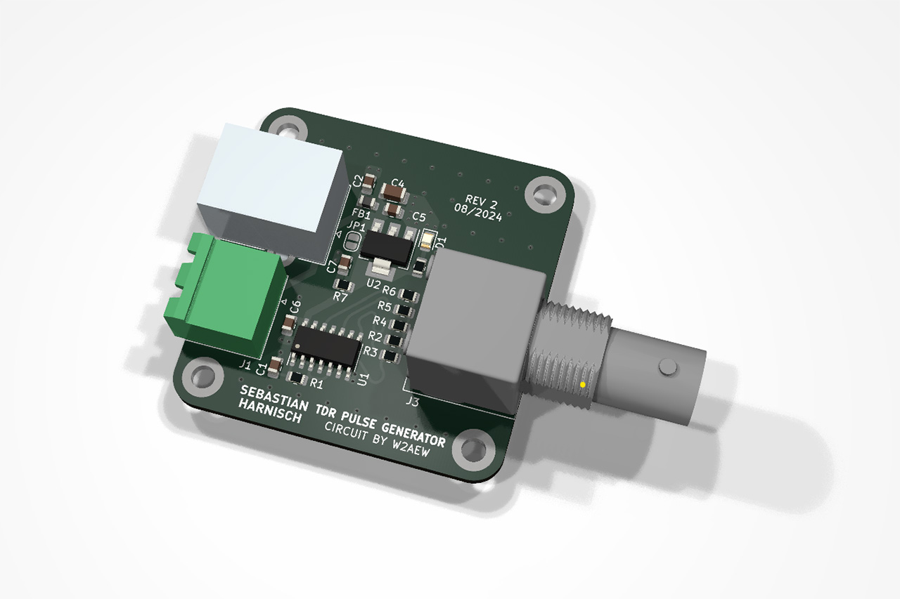
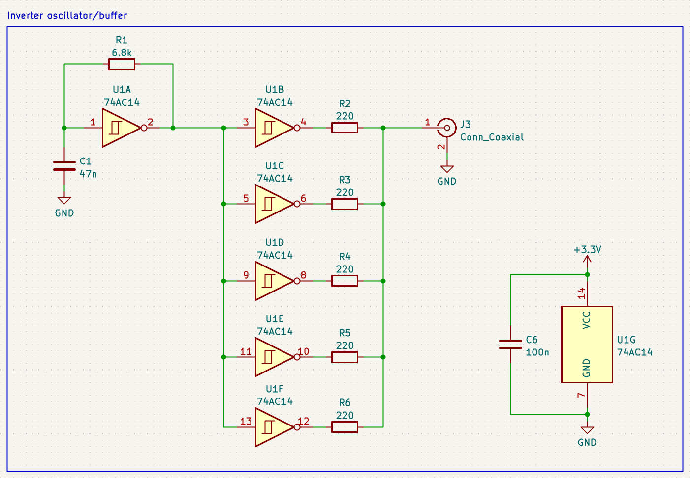
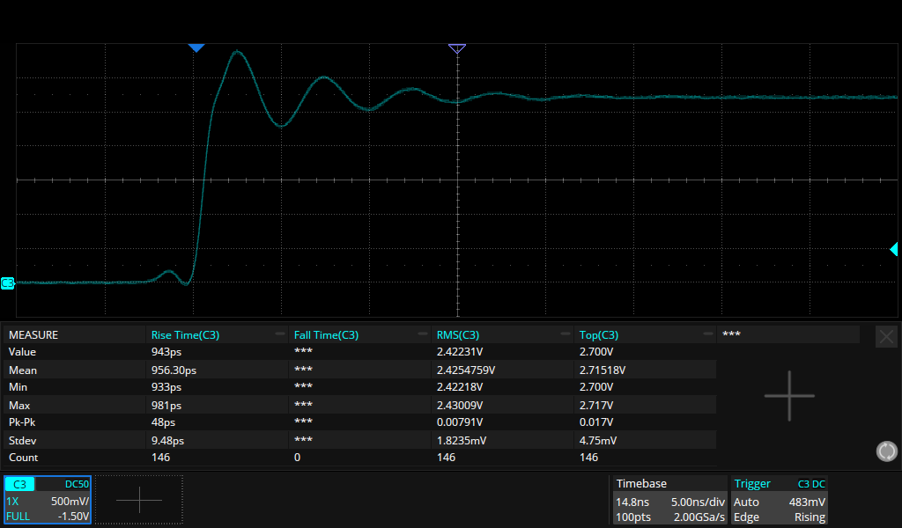

# TDR pulse generator

This repository contains the PCB design files (KiCAD 8) of a simple TDR pulse generator.

## Introduction

Almost a decade ago W2AEW posted a video on his YouTube channel showing a cheap and easy to build pulse generator for time domain reflectometry (TDR), consisting of only a simple hex inverter with schmitt-trigger inputs 74AC14 and a few passive components.
The schematic looks something like this:

It consists of a schmitt-trigger oscillator and a few inverters used as a driver with a (somewhat) fast rise time.

This repository contains an implementation of such a circuit.

## Results

For the test I used my Siglent SDS2000X Plus scope (500MHz, 800ps rise time typical @ 50 Ohm) which has to stretch its legs for this one: I measured a respectable rise time of about 960ps.
In his video, W2AEW measured something like 2ns of rise time for his circuit using DIP packaged hex inverter. Both his and my variant show a noticable ringing.

## Credits

Circuit presented by W2AEW on his youtube channel. The video can be found here: [https://www.youtube.com/watch?v=9cP6w2odGUc](https://www.youtube.com/watch?v=9cP6w2odGUc).

## Further information

More details are available on my personal site [https://sebastianharnisch.de](https://sebastianharnisch.de).

## Disclaimer

This repository and all data and information is provided "AS IS" without any warranty whatsoever.

